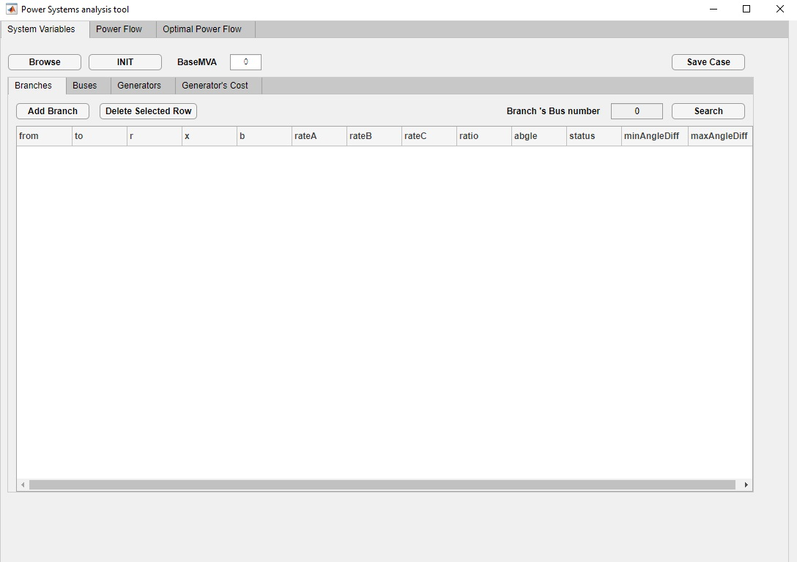
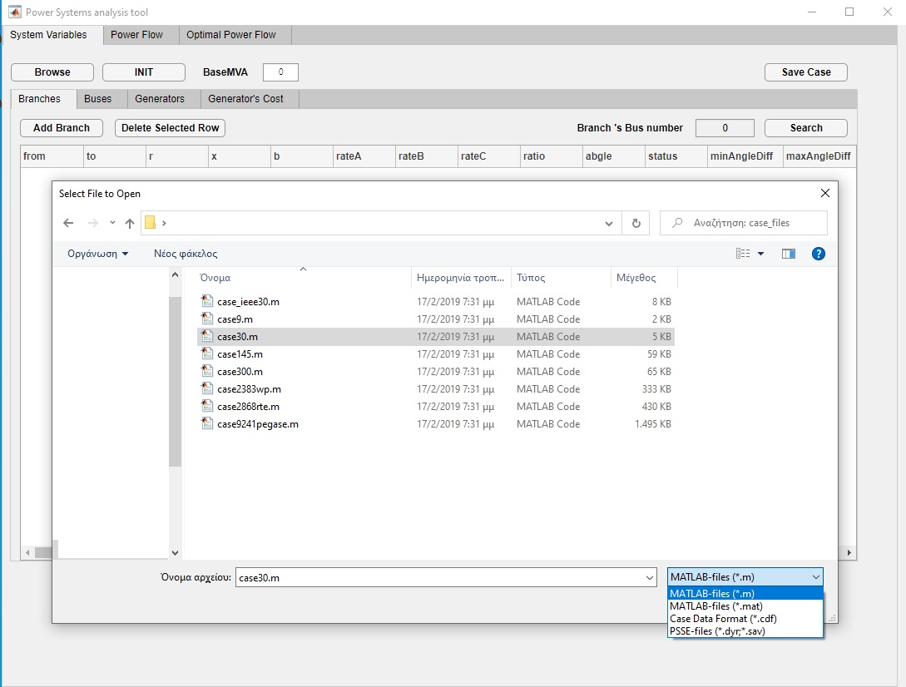
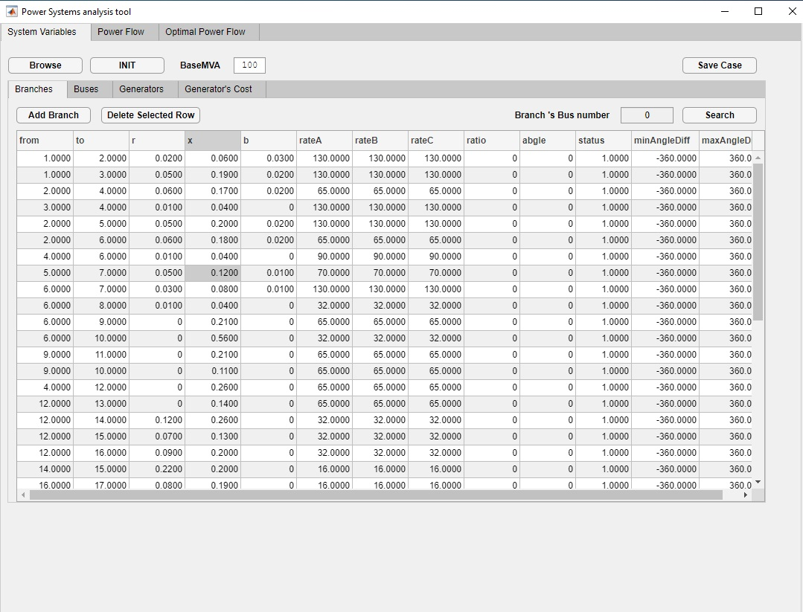
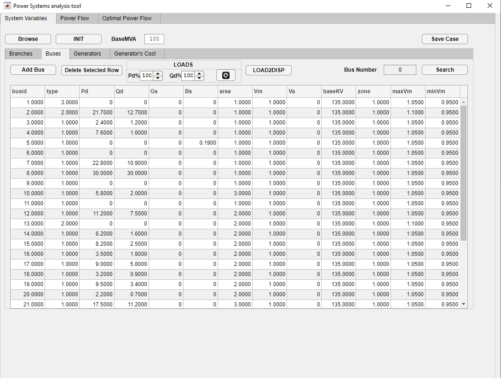
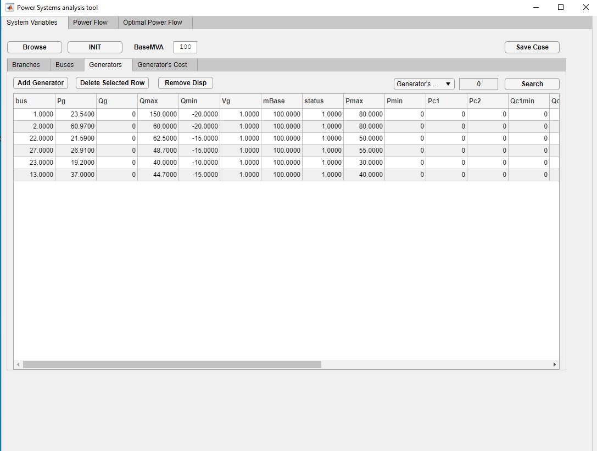
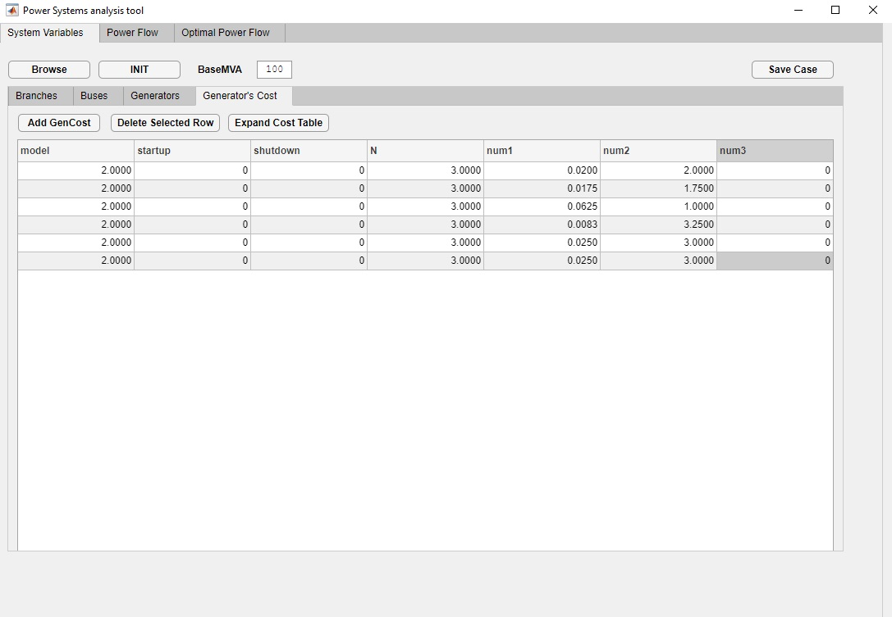
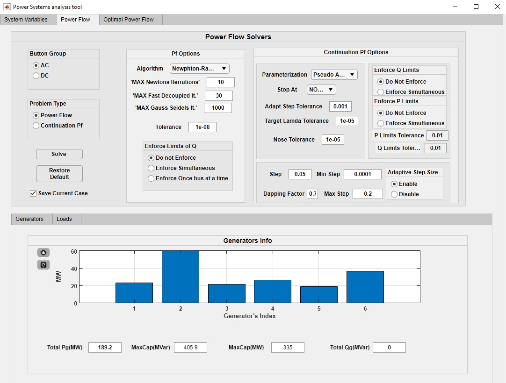
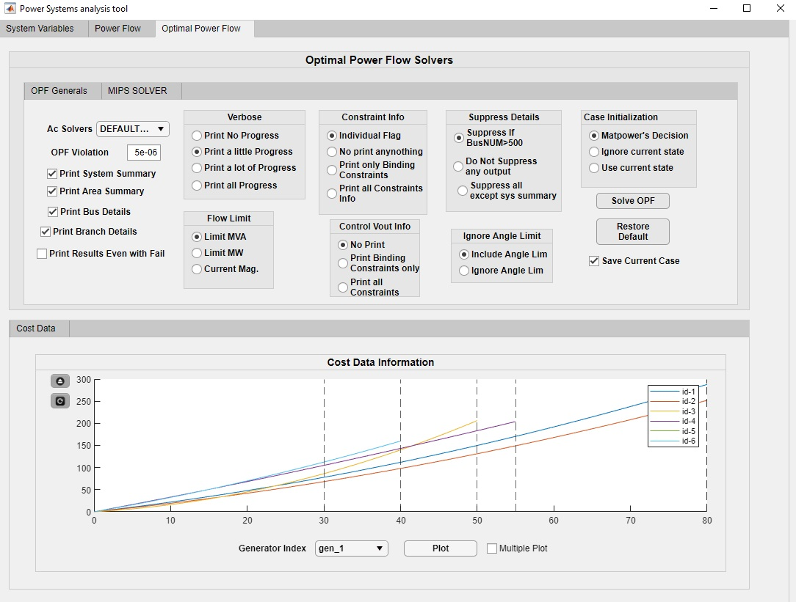

# PSat (Power System Analysis Tool)

A GUI on-top of Matpower for the import, edit and solve of different power grid problems with the usage of Matpower algorithms and solvers.

## Description

Insipired by my undergraduate thesis and the capabilities of Matpower and its value in the academic communty, this application helps power systems engineers and researchers to import or create new topologies of power systems.

## Table of Contents

- [PSat (Power System Analysis Tool)](#psat-power-system-analysis-tool)
  - [Description](#description)
  - [Table of Contents](#table-of-contents)
  - [Installation](#installation)
  - [System Variables](#system-variables)
    - [Branches](#branches)
    - [Buses](#buses)
    - [Generators](#generators)
    - [Costs of generators](#costs-of-generators)
  - [Power Flow](#power-flow)
  - [Optimal Power Flow](#optimal-power-flow)
  - [Contributing](#contributing)
  - [License](#license)
  - [References](#references)

## Installation

It is tested on Matlab version 2018b or greater versions.
The installation proccess is a typical .mlapp of Mathworks exosystem.
(Official Documentation could be found [here](https://uk.mathworks.com/help/matlab/creating_guis/apps-overview.html))

A sucessful installation will result in the following tab.

For the .mlapp plese contact the following [email](mailto:nikolaoskoutantos@gmail.com?subject=[PSAT-Installation]%20Source%20Han%20Sans).

## System Variables

The initialization of the application will result in the following pop-up window.

At first glance the System Variable tab is responsible for the topology of the network.
Generally we can import typical matpower cases or create a new power grid from scratch.
The browse button is responsible for the import of standard cases based on the supported Matpower formats.

  
The INIT button is responsible for the creation of a new topology.

 

### Branches

All the other tabs are typical PSSE format and an example is shown below.

The table above is completely editable and immediately connected with our case’s data, which are stored in the background of the application. As we can see we can add or delete a branch by clicking a cell to point that row. A basic search option is also given in case of medium or large scale systems.

 

### Buses

This subtab also offers editable capabilities. Addition and deletion are also offered as well as some other features. In the LOADS panel we can easily fluctuate the fixed loads of this system by selecting the percentage of the change not only in the real power demands but also for the reactive.
Load2disp button converts a fixed load into a dispatchable one.
Searching is also offered.

 

### Generators

This tab includes all the generators data.Addition, deletion and edit are offered as well as searching capabilities.
The Remove Disp button is responsible for the removal of a dispatchable load.
This load is not inserted as a fixed one again and we need to do it manually into the desired branch. This is not a malfunction but a safety measurement .

 

### Costs of generators

In this tab panel is included the economical factors of our systems.These factors are connected with each row of the generators table.Addition , deletion and editing are offered.

## Power Flow

Solve Pf button gives us the ability to run an analysis based on the current algorithm parameters and based on the parameters of the System Variables Tab. Changes could be achieved in the main panel with user’s interactions and these changes would automatically update all the variables for a custom solution in the background. The default Matpower’s options are used in the initialization of PSat and if we desire to restore them after a change we could achieve that through the Restore Defaults button.

The bar graph shows us a visual representation of each generator’s production as well as the dispatchable loads consumptions. A total of produced and consumed power is also represented as well as the limitations of our system as far as the power injection is concerned.

Undocking of the two figures is also possible as well as refresh.

## Optimal Power Flow

This tab in the same philosophy as the previous one we have the ability to run Optimal Power flow analysis based on the system. Default Matpower’s parameters are used also here and the user is able to make changes by his desire.

Solve OPF button is responsible to solve the system based on Optimal power flow theory and the capabilities , which are offered by Matpower. Restore Defaults is responsible to restore every change in the parameters section to the default one.

The line graph offers a basic visualization as far as the cost functions of the generators are concerned. A search between users and the plotting of the cost function is also possible through the Plot button.

Undocking is also possible for the below figure as well as the refresh.

Different and paid one solvers are also able to be included.

## Contributing

There is no contribution policy for the current state of the application.

## License 

Pending to be determined

## References

[1] R. D. Zimmerman, C. E. Murillo-S´anchez, and R. J. Thomas, “Matpower: Steady-State Operations, Planning and Analysis Tools for Power Systems Research and Education,” Power Systems, IEEE Transactions on, vol. 26, no. 1, pp. 12–19, Feb. 2011. doi: 10.1109/TPWRS.2010.2051168 1.1, 1.3 